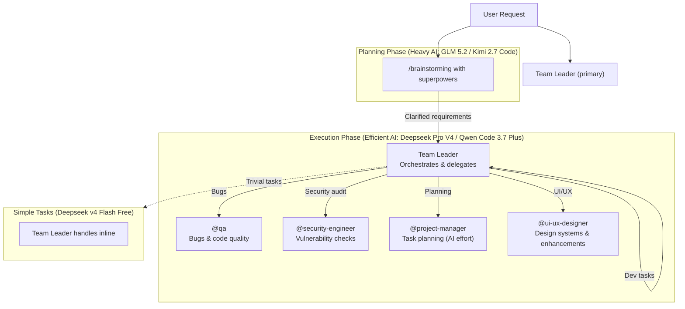

# OpenCode AI Agents

> ⚠️ **Experimental:** I'm currently exploring and experimenting with custom agents and their orchestration to shape my AI-assisted coding workflow. Things will evolve!

My custom agents and subagents for [OpenCode](https://opencode.ai) — an AI-powered CLI coding assistant. This repo defines a **Team Leader** orchestration pattern with specialized subagents for software development workflows.

## Architecture

## Workflow

### Planning Phase (Feature Builds)
1. User runs `/brainstorming` with **superpowers** enabled
2. Brainstorming clarifies intent, requirements, and architectural decisions
3. **Heavy AI models** used here: **GLM 5.2** or **Kimi 2.7 Code**
4. Once requirements are clear, planning is handed off to Team Leader

### Execution Phase
1. **Team Leader** receives the clarified requirements
2. Delegates work to the most efficient subagent(s) for each task
3. **Superpowers skills are NOT used** during execution (token efficiency)
4. **Efficient AI models** used here: **Deepseek Pro V4** or **Qwen Code 3.7 Plus**
5. Team Leader reviews and integrates results

### Dev Tasks (Implementation)
- **Team Leader directly writes and creates the code** — no subagent delegation needed for straightforward development
- Uses **Deepseek Pro V4** or **Qwen Code 3.7 Plus** for efficient generation
- Covers: implementing features, writing business logic, creating APIs, building components, etc.
- Team Leader acts as the primary developer, only calling subagents when specialized input is required

### Non-Feature / Maintenance Work
- **@qa** — Bug detection, code quality reviews, test improvements
- **@security-engineer** — Vulnerability scanning, dependency audits, secure code review
- **@ui-ux-designer** — Design systems, UI enhancements, accessibility audits, responsive layouts

### Simple / Trivial Tasks
- Handled directly by **Deepseek v4 Flash Free** to conserve token budget
- No subagent delegation needed

## Model Strategy

| Phase | Models Used | Rationale |
|-------|-------------|-----------|
| **Planning / Brainstorming** | GLM 5.2, Kimi 2.7 Code | Heavy reasoning, deep architectural thinking |
| **Execution** | Deepseek Pro V4, Qwen Code 3.7 Plus | Efficient code generation without token bloat |
| **Simple Tasks** | Deepseek v4 Flash Free | Minimal cost, fast turnaround |
| **Superpowers Skills** | Planning only | Too expensive for execution; disabled during implementation |

## Cost & Limits (OpenCode Go)

OpenCode Go is the underlying subscription powering these agents: **$5 first month, then $10/month**.

### Usage Limits by Period

| Period | Usage Cap |
|--------|-----------|
| 5 hours | $12 |
| Weekly | $30 |
| Monthly | $60 |

### Estimated Requests Per Model

Based on observed average usage patterns across Go subscribers.

| Model | Reqs / 5h | Reqs / Week | Reqs / Month | Cost / Session |
|-------|-----------|-------------|--------------|----------------|
| **GLM-5.2** (Planning) | 880 | 2,150 | 4,300 | $2.34 |
| **Kimi K2.7 Code** (Planning) | 1,350 | 4,630 | 9,250 | $1.03 |
| **DeepSeek V4 Pro** (Execution) | 3,450 | 8,550 | 17,150 | $0.65 |
| **Qwen3.7 Plus** (Execution) | 4,300 | 10,800 | 21,600 | $0.59 |
| **DeepSeek V4 Flash** (Simple tasks) | 31,650 | 79,050 | 158,150 | $0.08 |
| **MiMo-V2.5** (Budget) | 30,100 | 75,200 | 150,400 | $0.04 |

### Token Pricing (per 1M tokens)

| Model | Input | Output | Cached Read |
|-------|-------|--------|-------------|
| **GLM-5.2** | $1.40 | $4.40 | $0.26 |
| **Kimi K2.7 Code** | $0.95 | $4.00 | $0.19 |
| **DeepSeek V4 Pro** | $1.74 | $3.48 | $0.015 |
| **Qwen3.7 Plus** (≤256K ctx) | $0.40 | $1.60 | $0.04 |
| **Qwen3.7 Plus** (>256K ctx) | $1.20 | $4.80 | $0.12 |
| **DeepSeek V4 Flash** | $0.14 | $0.28 | $0.003 |
| **MiMo-V2.5** | $0.14 | $0.28 | $0.003 |

> Cache hit rates average **95–96%** across all models, significantly reducing effective cost.

### Token Budget Strategy

| Phase | Model | Approx tokens/req | Monthly reqs | Monthly tokens |
|-------|-------|-------------------|-------------|----------------|
| Brainstorming | GLM-5.2 / Kimi K2.7 Code | ~53K cached + ~200 output | 200–400 | ~21M – ~42M |
| Execution | DeepSeek V4 Pro / Qwen 3.7 Plus | ~83K cached + ~300 output | 1,000–2,000 | ~84M – ~168M |
| Simple fixes | DeepSeek V4 Flash | ~69K cached + ~280 output | 5,000+ | ~345M+ |

> **Note:** Project Manager effort estimates reflect **AI effort** (agent compute time), not human effort. This adjusts expectations for task sizing in an AI-driven pipeline.

## Agents

### 🧠 Team Leader ([`team-leader.md`](team-leader.md))
**Mode:** primary | **Role:** Orchestrator

The top-level agent that coordinates all work. It understands user requirements, breaks them down, delegates to the right subagents, and synthesizes results.

**Delegation targets:**
- `@qa` — Code quality & testing
- `@security-engineer` — Security audits
- `@project-manager` — Task planning & tracking (AI effort estimates)
- `@ui-ux-designer` — UI/UX design & front-end

### 🧪 QA Engineer ([`qa.md`](qa.md))
**Mode:** subagent | **Role:** Quality Assurance

Writes tests, reviews code for bugs, analyzes coverage, validates fixes, and ensures best practices for testability.

### 🔒 Security Engineer ([`security-engineer.md`](security-engineer.md))
**Mode:** subagent | **Role:** Application Security

Performs security code reviews, threat modeling, dependency auditing, and checks for OWASP Top 10 vulnerabilities, secrets, and misconfigurations.

### 📋 Project Manager ([`project-manager.md`](project-manager.md))
**Mode:** subagent | **Role:** Planning & Tracking

Breaks down requirements into tasks, estimates **AI effort** (not human effort), identifies dependencies and risks, and tracks progress with status summaries.

### 🎨 UI/UX Designer ([`ui-ux-designer.md`](ui-ux-designer.md))
**Mode:** subagent | **Role:** Design & Front-End

Creates design systems, responsive layouts, accessible components, and user flows. Covers UI design, UX design, front-end architecture, and accessibility (WCAG 2.1 AA).

## Skills

Skills used in this workflow:

- **`/brainstorming`** — Planning & requirement clarification (superpowers-enabled, heavy AI)
- **`/caveman`** — Ultra-compressed communication during execution to save tokens

## Getting Started

To use these agents in your own OpenCode setup:

1. Clone this repo to `~/.config/opencode/agents/`
2. Restart OpenCode
3. Start a session and the Team Leader will be your default agent
4. Reference subagents with `@` mentions (e.g., `@qa review this code`)

## License

MIT
